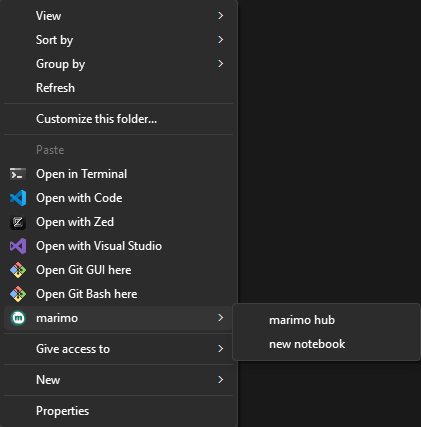
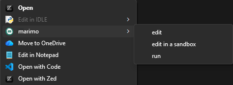

# contextimo

 

### Overview
This is a quick and simple way to add some [marimo](https://github.com/marimo-team/marimo)-related options to the Windows context menu. Unfortunately the [underlying python library](https://github.com/saleguas/context_menu) only partially supports Linux, and has no support for Mac.
### Installation
To create the context menus, use `python contextimo.py add`, or `uv run contextimo.py add`. The added menus can also be removed with `python contextimo.py remove` (or using `uv`, as before).
### Usage
At present, contextimo adds two menus: one which appears in the context menu when the desktop or a directory background is selected, and one which appear when python files are selected. The first of gives the option to either create a new notebook (using `marimo new`) or open the marimo hub (`marimo edit`). The python-specific menu has three options: `edit`, `edit in a sandbox` (requires `uv`), and `run`.

### Future
This was just a quick side project, so I don't plan on doing much with it in the future. If I get the opportunity to make it cross-platform, I would like to do so, but I currently don't have the knowledge required. Any suggestions for commands to add are welcome; I simply added the ones which I use most often.
